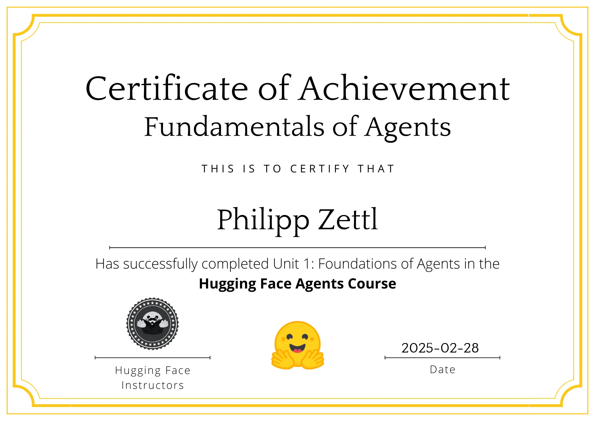
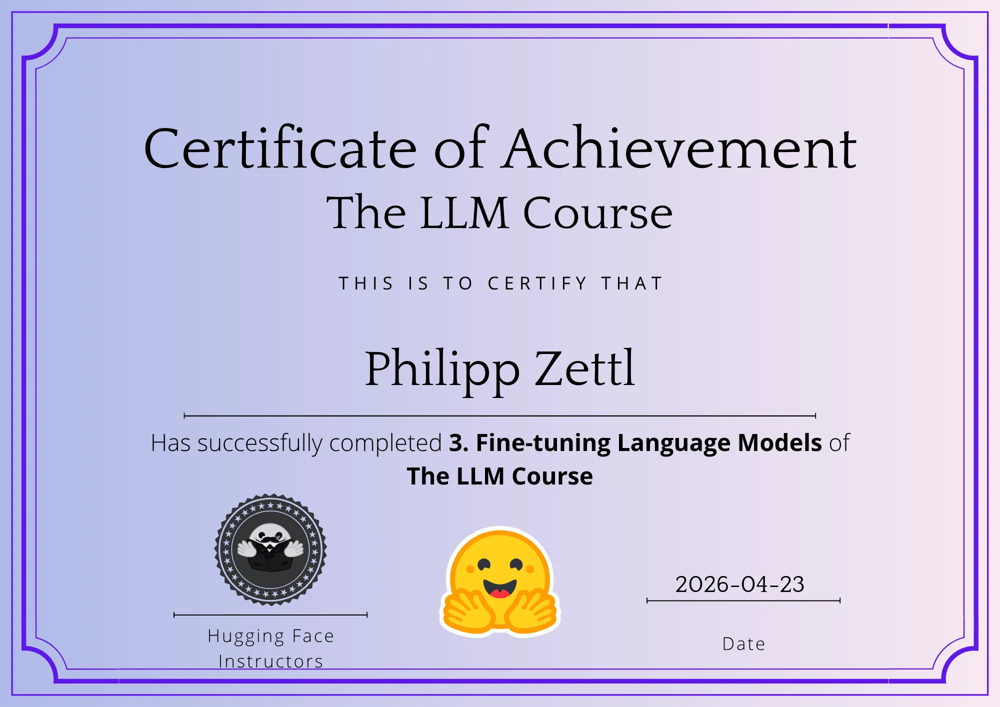
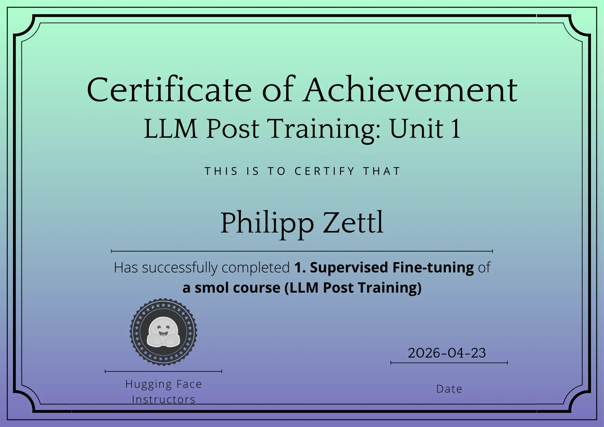
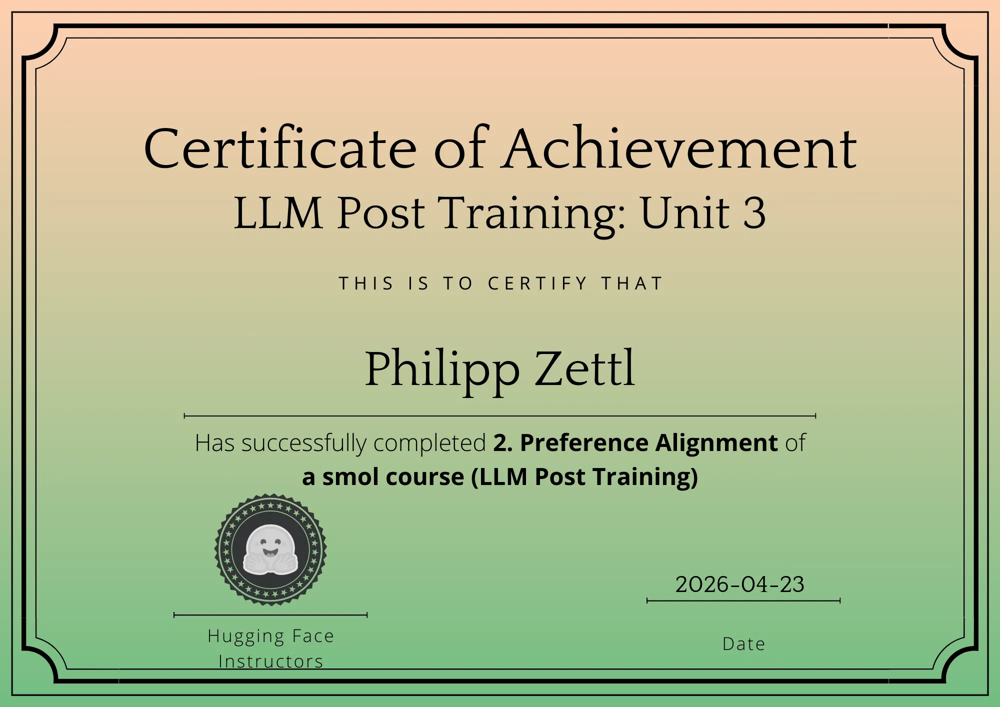
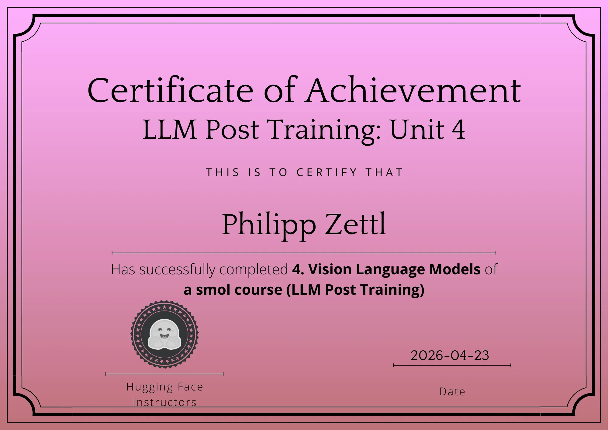

### Hi there 👋
[Download my full CV (PDF)](https://github.com/philsupertramp/philsupertramp/releases/latest/download/cv.pdf)

My name is Philipp.
I have a B. Sc. in Mathematics and am a big software engineering entusiast that loves to explore numerical and statistical methods to solve problems.

My most recent projects are
- [learn-dis/learn-dis](https://github.com/learn-dis/learn-dis): a distributed training service for ML models. Originally a research project to test the feasibility of FedAvg on private training data provided by external remote clients.
- [philsupertramp/factory](https://github.com/philsupertramp/factory): a generative AI service that bundles wide-spread Text-To-Image, Text-To-Text, Text-To-Speech and Speech-Recognition tasks. It's constantly getting updates and it's for sure worth a look!

Until 2021 my main focus in software development was to build useful tools for WebDev and everything involved in it.  
Ranging from an educational course in
- 🐋 [philsupertramp/docker](https://github.com/philsupertramp/docker) a "3 day" course on how to use docker

To usability tools like a helper/wrapper script around docker-compose
- 🐋 [philsupertramp/docr](https://github.com/philsupertramp/docr) a docker-compose utility script

An API testing framework
- 🤖 [philsupertramp/chain-smoker](https://github.com/philsupertramp/chain-smoker) a testing tool to record and execute (mainly REST-API) smoke tests.

And many many extensions for Django (a python web framework)
- 🐮 [Django](https://www.djangoproject.com/) tools: [philsupertramp/django-data-migration](https://github.com/philsupertramp/django-data-migration) a decoupled migration system exclusively for data transformations and [philsupertramp/dj-migration-test](https://github.com/philsupertramp/dj-migration-test) a django library assisting to write unit tests for data migrations.

Apart from this, I've also published my starter repository for TeX Projects
- 🗎 [philsupertramp/tex-starter](https://github.com/philsupertramp/tex-starter) a LaTeX starter project, to jump-start a large tex document

and I am the proud author of

- 🔭 [philsupertramp/game-math](https://github.com/philsupertramp/game-math) a math library for game developers, which includes a load of mathematical helpers to do all sorts of things, including several Machine Learning algorithms too and the beginning of a symbolic math extension.
  
  
There is much more to discover in my repositories, give em a look you won't regret it 😉
  
  
- ✍️ You can contact me via [Mail](mailto:philipp@godesteem.de) or other social channels listed in my profile

----
Check out my contributions on other platforms, like HuggingFace 🤗

https://philipp-zettl-my-heatmap.static.hf.space

----

- 👨‍🏫 Early 2022 I wrote [my Thesis](https://github.com/philsupertramp/inet) with the topic: **"Machine Learning Methods for Localiazation and Classification of Insects in Images"** and plan to build a more advanced guideline for object detection / image classification tasks.
- 🧑‍🏫 In summer 2023 I taught an introductory class to Machine Learning at Berliner Hochschule für Technik (BHT)

----

## 📜 Certificates

<table>
  <tr>
    <td align="center">
      
       
      <b>Fundamentals of Agents</b> 
      <i>Hugging Face</i>
    </td>
    
    <td align="center">
      
       
      <b>The LLM Course: Fine-Tuning</b> 
      <i>Hugging Face</i>
    </td>

    <td align="center">
      
       
      <b>LLM Post Training: Supervised Fine-tuning</b> 
      <i>Hugging Face</i>
    </td>
  </tr>
  <tr>
    <td align="center">
      
       
      <b>LLM Post Training: Preference Alignment</b> 
      <i>Hugging Face</i>
    </td>

    <td align="center">
      
       
      <b>LLM Post Training: Vision Language Models</b> 
      <i>Hugging Face</i>
    </td>
    
    <td></td>
  </tr>
</table>

# 📊 GitHub Stats:
 
 

## 🏆 GitHub Trophies

### 🔝 Top Contributed Repo

